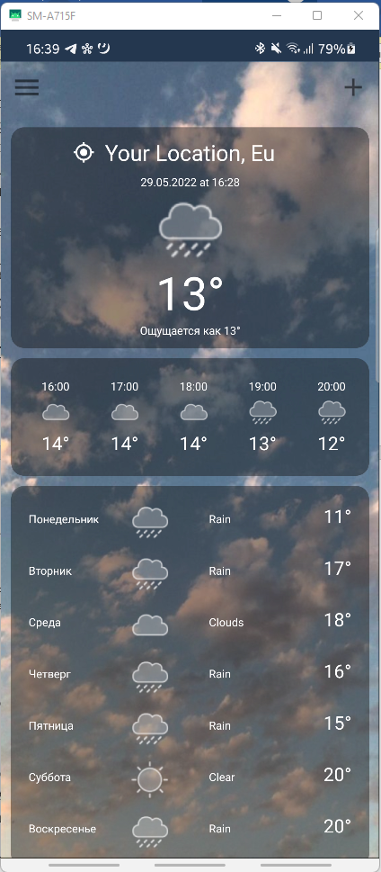
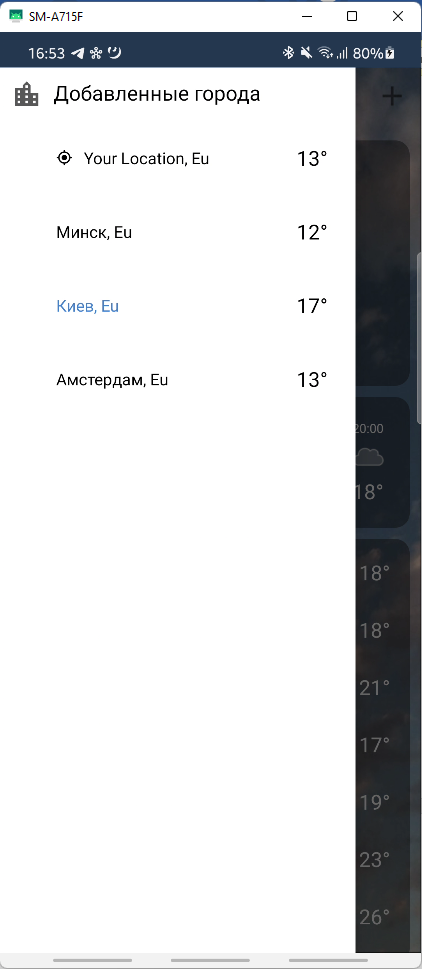

# ForecastApp-Android-

[Download apk](https://github.com/SobolevvMaxim/ForecastApp-Android-/blob/master/apk/app-forecast.apk)

## API_KEY

!! Don't forget to put your API_KEY in buildSrc/Dependencies

## Preview

 

## Stack

- Kotlin
- MVVM
- Retrofit
- Room
- Coroutines
- GSON
- Hilt (Koin in another branch)

## Features

- Load default city (Minsk) weather at first start or by user location
- Get city forecast by name
- Tap the city to choose it
- Long tap to delete the city
- Navigate to main screen to see week and day forecast
- Animation between the fragments
